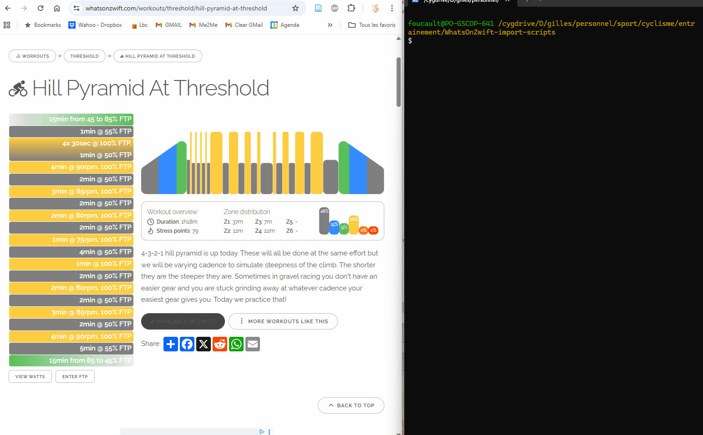

# WhatsOnZwift imports scripts

This project is a collection of scripts to import workouts from WhatsOnZwift to:
- intervals.icu workout text editor
- GoldenCheetah workout text editor

## Description

You should copy/paste the resulting text into the target editor.

### Dependencies

python version >= 3.12
pip
```
pip install requests bs4
```

### Installing

Copy raw python script to your preferred location, and install prerequisites.

### Executing program

To import a workout from WhatsOnZwift to intervals.icu:
* ```text-to-whatsonzwift.icu.py "Dirty Teeth Drills.txt"```
* -or- ```whatsonzwift-to-gc.py https://whatsonzwift.com/workouts/threshold/hill-pyramid-at-threshold``` and copy output text to Golden Cheetah > [Workout editor](https://www.youtube.com/watch?v=oq2j4kgNoA0) > New [MRC - Relative Watts] > Properties  
* -or- ```whatsonzwift-to-intervals.icu.py https://whatsonzwift.com/workouts/threshold/hill-pyramid-at-threshold```  and copy output text to intervals.icu > Edit Calendar Entry > [Workout Builder](https://forum.intervals.icu/t/workout-builder/1163) 

### Golden Cheetah usage demo


### intervals.icu usage demo


